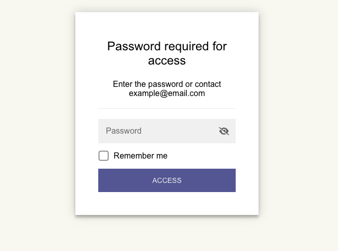

# Create a password-protected Quarto website

This is a Quarto website template with password protection, using the
[staticryptR](https://github.com/nikitoshina/staticryptR) package.

This will encrypt the rendered website and put it behind a simple password
prompt. It does not encrypt the source files -- they will still be visible if
they are in a public repository -- so this is likely most useful if the source
files are in a private repository but GitHub pages is set to be public (e.g.,
for [GitHub Enterprise Cloud
users](https://docs.github.com/en/enterprise-cloud@latest/pages/getting-started-with-github-pages/changing-the-visibility-of-your-github-pages-site)),
GitHub Pro, and GitHub Team. With [GitHub
Free](https://docs.github.com/en/get-started/learning-about-github/githubs-plans)
(personal and organizations) it is not possible to publish a GitHub Pages
website from a private repository

Using staticryptR requires Node and the
[staticrypt](https://github.com/robinmoisson/staticrypt) Node library to be
installed on your computer:

- Install [Node](https://nodejs.org/en/download) for your operating system.

In R:

- Install [staticryptR](https://github.com/nikitoshina/staticryptR)

    ```
    install.packages("staticryptR")
    ```

- Run the following to install the `staticrypt` Node library:

    ```
    staticryptR::install_staticrypt()
    ```

`encrypt.R` contains the script that will do the encryption. This script will be
run automatically when the site is rendered by `quarto render` or `quarto
preview`, as it it is specified in the `post-render` paramater in `_quarto.yml`.

Set any options you like in the call to `staticryptR::staticryptr()` in
`encrypt.R` (see `?staticryptR::staticryptr`).

The recommended way to set the password is to leave the `password` parameter as
`NULL` in the call to `staticryptR::staticryptr()` in `encrypt.R`, and set an
environment variable called `STATICRYPT_PASSWORD` to the password of your
choosing. This is best done in a file called `_environment.local` file, adding a
line like this:

    ```
    STATICRYPT_PASSWORD=<your_password>
    ```

This file is [consulted by Quarto during
rendering](https://quarto.org/docs/projects/environment.html#local-environment).
It is in the default `.gitignore` file of this repository and so will not be
checked in to version control and thus not exposed in your repository on GitHub.

If your source code is in a private repository and you want your collaborators
to see the password, you can set it directly in the call to
`staticryptR::staticryptr()` in `encrypt.R`, and _don't_ set it in
`_environment.local`.

Render the site as you normally would. After it is rendered, when you visit your
site it will present you with a password prompt:



Enter the password. `staticrypt` encrpyts each page individually, which means
you will need to enter your password each time you visit each page on the site,
which can become tedious. If you click the "remember me" checkbox, it will avoid
you having to do this.

## Publishing

By default this template renders and encrypts the site in the `docs/` directory
in the main branch. To publish it using GitHub pages, go to your repository on
GitHub and:

1. Click "Settings"
2. Click "Pages"
3. Under "Build and Deployment > Source", choose "Deploy from a branch"
4. Under "Branch" choose "main" and "/docs".


You can see the rendered and encrypted site for this repository
[here](https://andyteucher.ca/quarto-private-website). The password is
_password_.

If you would prefer to render to the `gh-pages` branch and publish via a GitHub
action, without needing to install Node on your computer, see the repository
template at
[ateucher/quarto-private-github-actions](https://github.com/ateucher/quarto-private-gh-actions).
